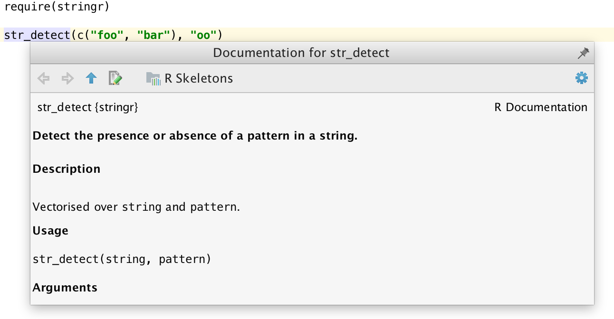
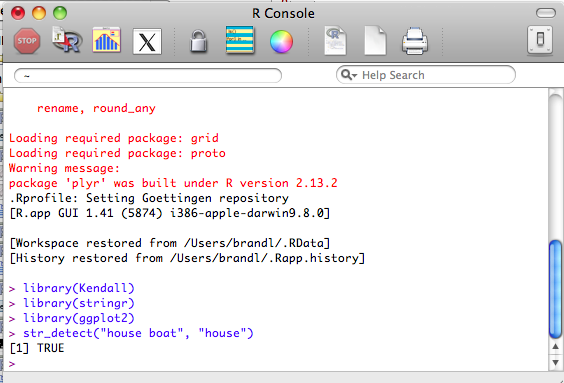

This project provides an integration of R, which is a language for statistical computing and graphics, into Intellij&nbsp;IDEA. It aims to bring the best language for data mining and modeling in touch with the best IDE ever. 

By implementing a parser for R, the plugin allows for syntax highlighting, intelligent code folding and completion,&nbsp;refactorings, and more. 

Installation
----

1.  Get Intellij IDEA, which is available as pro and and as free open-source community edition from&nbsp;[JetBrains](http://jetbrains.com).
2.  To install the plugin, just open the plugin manager in Intellij Idea, search for "R4Intellij" , and finally click&nbsp;install.

Support
----

Feel welcome to ask questions in the plugins [discussion&nbsp;forum](http://devnet.jetbrains.net/community/idea/plugins) of Intellij. Don't forget to tag your posts with the tag r4intellij (otherwise we might not read it). 

Before you asked questions, you should consider to read our [FAQ](/faq.md). 

Basic Usage
----

Just drag an R-file into idea and start hacking.

You can also create a new project (the type does not matter) and organize your work into modules with different&nbsp;content roots. Read the Intellij [documentation](http://www.jetbrains.com/idea/webhelp/intellij-idea.html) for more&nbsp;details about to do this. 

### File extensions

By default R4Intellij supports these file extensions: .R IntelliJ offers the possibility to link so far unknown file extensions to a plugin. Just choose R4Intellij to open files&nbsp;with this newly registered file extension as R files. 

### Source code navigation

The following features are supported 

*   Go To --&gt; Declaration (of symbols and locally defined functions)*   View --&gt; Quick Definition Lookup (of functions): This will show the signature and a short title

 

*   Search --&gt; Highlight Usage: This will make Intellij to highlight all locations where a function or a symbol is&nbsp;being used*   Brace matching: If you position the caret before or after a bracket then IntelliJ will highlight the other element of&nbsp;the pair of brackets.*   File Structure View: In the structure view IntelliJ shows the functions and code sections of the R script.

Most of these functions use the default shortcuts of the Intellij platform. Custom shortcuts can be inferred from the&nbsp;menu entries. 

Integration with R session
----

R4Intellij supports the evaluation of the current selection or line on Windows (RGui) and MacOS (R GUI, Terminal, [iTerm2](http://www.iterm2.com/)). Furthermore, the user can define up to 4 custom code action which allow to wrap the current selection into some function before sending it to R. For instance, a custom **head of a data.frame** action would be defined as _head(%snippet%);_. These custom code actions can be defined in the preferences and can get keyboard shortcuts assigned to them. 

 

 

On Mac, by default Ctrl+Option+Enter sends the current line or selection to the R Gui app. If RGui is not already started it will be started on the Mac dock and you may have to click it to make it visible. (If you did not know this you may think that nothing happened.) To send to the Terminal instead of RGui, go to IntelliJ->Preferences->Other settings->R4Intellij and change the "Snippet Evaluation Target" to Terminal. This is the Mac Terminal not the Terminal embedded in Intellij but that may well be what you wanted or hoped for anyway. The Evaluate menu option is accessible via the right-click floating context menu, not from the main IntelliJ application menu. To change the shortcut key for Evaluate, go to Preferences->Keymap->Plug-ins->R4Intellij->Evaluate then right click and "Add keyboard shortcut"; e.g. F5. You can have many Terminal sessions running and pressing F5 in Intellij will now send that line or selection to the last active Terminal (similar to NppToR on Windows). That snippet may well be R code or it could be bash commands or Python (or anything with a prompt, perhaps via ssh) that you have running in that Terminal. There is no limit to the number of Terminal sessions (unlike the limit of 4 in r-gedit). Very useful!

Code completion
-----

R4Intellij builds an index of your local R installation which allows for much better completion, local error highlighting,&nbsp;integrated documentation lookup and more. 

To build the index of all packages installed in your R instance, R4Intellij needs . On most platforms it will guess it&nbsp;correctly, but you can adjust it if necessary in the preferences. 

The following completion modes are available: 

*   Basic word completion for variables and local functions*   Coming soon: Package name completion in library statements*   Coming soon: setwd() aware path completion*   Coming soon: completion of package names in library statements

Refactoring
----

All refactorings can be accessed via the "Refactor" menu

*   Renaming of symbols and functions

Intentions
----

Intentions are on-the-fly checks of your R scripts, that highlight problems and (optionally) suggest automatic&nbsp;quick fixes 

*   Auto-import of packages given a function name

Planned &amp; Coming soon
----

* Source code formatting
* Code transformation fixes (like: Convert qplot to ggplot call)
* More refactorings (Extract function; Extract variable)
* More context-aware autocompletion for variables, functions and file paths
* Inspections and quickfixes for common problems

Feel welcome to suggest new features by adding a ticket to our tracker! 

Platform features
----

The main strength of our plugin is the underlying Intellij IDE. So if you have not worked with it before, read more&nbsp;about all its amazing [features](http://www.jetbrains.com/idea/index.html). It ships with everything from SCM&nbsp;integration (Git, Subversion, etc.), neat SQL integration, bash scripting support, and so many more interesting&nbsp;features. However, its main "feature" is its usability. Give it a try!

You're still not convinced? Try something else!
----

Give a try to [StatET](http://www.walware.de/goto/statet), [textmate](http://macromates.com/) (with the&nbsp;[rbundle](http://worldofrcraft.blogspot.com/2008/11/setting-up-textmate-to-use-r.html)), or [RStudio](http://rstudio.org/`).

Feel welcome to report problems or suggest new features by adding an issue to our&nbsp;[tracker](https://code.google.com/p/r4intellij/issues/list). Or be a hero and send us a pull reuest

Further reading
---------------

* [development notes](devel_notes.md) 
* [Pointer into Intellij OpenApi](openapi_notes.md) 
* [Release History](Changes.md) 
* [FAQ](faq.md) 

Acknoledgements
----

This project was rebuilt by merging it's codebase with a fork of [The R plugin](https://github.com/ktisha/TheRPlugin). So most credits go to go [ktisha](https://github.com/ktisha).
  
This project would not have been possible without great [bash plugin](https://plugins.jetbrains.com/plugin/4230?pr=phpStorm) which inspired us a lot when getting started with r4intllij, and from which we borrowed also some code.
