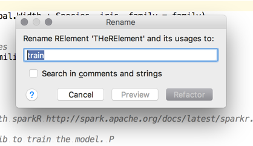

R4Intellij Development Notes
----------------------------

Also see [OpenApi notes](openapi_notes.md)


Next steps
----------


## 0-day bugs

* skeleton action is broken

* fix naming in dialog

* indexing fails
```
Failed to run script: package_summaries.r
Exit code: 2
Error Output: 
java.lang.Throwable
	at com.intellij.openapi.diagnostic.Logger.error(Logger.java:132)
	at com.r4intellij.packages.RHelperUtil.getHelperOutput(RHelperUtil.java:64)
	at com.r4intellij.packages.LocalRUtil.getInstalledPackages(LocalRUtil.java:43)
	at com.r4intellij.packages.RPackageService.refreshIndex(RPackageService.java:145)
	at com.r4intellij.packages.RPackageService$1.run(RPackageService.java:90)
	at com.intellij.openapi.application.impl.ApplicationImpl$2.run(ApplicationImpl.java:309)
	at java.util.concurrent.Executors$RunnableAdapter.call(Executors.java:511)
	at java.util.concurrent.FutureTask.run(FutureTask.java:266)
	at java.util.concurrent.ThreadPoolExecutor.runWorker(ThreadPoolExecutor.java:1142)
	at java.util.concurrent.ThreadPoolExecutor$Worker.run(ThreadPoolExecutor.java:617)
	at java.lang.Thread.run(Thread.java:745)

```

* import action does not work for chunks. (should package imports be extracpolated to the complete file?)
 
 
### Implement proper completion contributor

* for installed and not installed packages

http://www.jetbrains.org/intellij/sdk/docs/tutorials/custom_language_support/completion_contributor.html

    
### 1. Go to reference

*  http://www.jetbrains.org/intellij/sdk/docs/tutorials/custom_language_support/reference_contributor.html
* https://intellij-support.jetbrains.com/hc/en-us/community/posts/207250965-PsiReferenceContributor-Find-Usages-and-Go-to-Declaration

* seems to work within a within project context even across files. 
* FIXME does not work for library funcitons yet
* TBD redeclaration of function with same name (prefer local over global; same dir over other dir)
 


usage search works also across functions

* improved dplyr life template


## potential improvements and differences

general
* auto-detect R and do not force user to specify installation location
* function help should be context aware
* no live-templates
* structure view
* run does not work for macos

intentions
* auto-import missing packages (use com.jetbrains.ther.packages.TheRPackagesUtil#getInstalledPackages)
* auto-install missing packages in require


## Known issues

missing arg inspection does not recognize dplyr piping --> Ignore first arg if right-hand-size of pipe 

2017-01-18 11:31:43,875 [1353648]   INFO - r4intellij.typing.RTypeContext - Possible deadlock, break waiting 


## later features

* after function name completion, cursor should end up between brackets

* implement new fenceprovider for enhanced RMd snippet injection https://github.com/JetBrains/intellij-plugins/pull/464#event-918221586

* shortcut to evaluate current expression and proceed

* intention to replace tidyverse imports with library(tidyverse)

* highlight packages with naming conflicts (or indicate it visually in the IDE using virtual comment)

* path completion within strings. Regular completion provider seems to apply.
    * support relative paths liks `test.txt`, `../foo.txt`
    * warn about missing data; and 
    
```r
# similar to type annotation
# @type recursive : logical

# Examples: 
# @working-dir ../../
# @working-dir ~/Users/
# @working-dir ${FOO}/bar

```
* show library import suggestions also for infix operators (like %<>% --> magrittr)
* also support rstudio like sectioning 

* make sure all rstudio refactorings work as well


---
* add title to package view like in RS:


* also add links to package names to go to cran/bioconductor homepages

---
integrate with table editor in intellij

* https://www.jetbrains.com/help/idea/2016.3/working-with-the-table-editor.html
* Allow to open table by clicking (R Console session required)

* warn if data-frame arguments are not declared in script (with comment annotation option to flag presence). Since this is not possible on a general we could/should provide it for certain APIs like tidyverse

* intention in case of naming conflicts (same functions in imported packages) suggest to add prefix to method call (allow to override by annotation)

* bug: renaming for loop variables is broken

```r
for (name in packageNames) {
    if (paste(name, "r", sep=".") %in% list.files(path=args[1])) {
        next
    }
}
```

* offer quickfix to surround if expression with curly brackets


* necessity of 
```
application.invokeLater(new Runnable() {
    @Override
    public void run() {

        application.runWriteAction(new Runnable() {
        ....
```

Release Action List
===================

1. Increase version
2. Snapshot on github
3. Run tests
4. Deploy jar and upload to plugin reposiotry


Brainstorming  & Roadmap
=======

* Basic refactorings to match StatET ()

* File path completion (learn from bash plugin)
* Already possible by injecting bash into literal
* Better highlighting of syntax errors
* Intention to add roxygen docu + code basic tag completion for roxygen comments
* Intention to change function to S4 function
* Connectors for xterm and Rgui on windows


* Check that function is available and provide import library statement if necessary
* More context-aware auto-completion for variables, functions and file paths
* Push to R also for windows
* Example? Arc:ReplToolWindow
* ColorSettingsPage (see Bash implementation)
* Show parameter info
* BnfAnnotator: psi-aware highlightling of syntax elements


## Options for code snippet evaluation

* R Session has almost complete implementation for console, objects, etc
* TextMate bundle
    * Start R in special mode that reads all input from file and writes all output to another one which then somehow imported into textmate
* I think FindWindow and SendMessage are the functions you want to use, in general.
* Use the clipboard
* Tinn-R: It also pops up additional menu and toolbar when it detects Rgui running on the same computer. These addons interact with the R console and allow to submit code in part or in whole and to control R directly. 
    * It seems to have some limitations
* Maybe DOM is a solution: rdom, RDCOMClient
* Or white 
* Or most promising, we could try to use the windows API via VBScript or C#


## Rnotebook support


Direct md embedding like in Rstudio


are not possible in the intellij editor, see 
https://intellij-support.jetbrains.com/hc/en-us/community/posts/206756045-Displaying-an-image-in-source-code-editor


http://stackoverflow.com/questions/29718926/saving-the-state-of-a-webview-and-reloading-the-position

http://rmarkdown.rstudio.com/r_notebook_format.html

http://rmarkdown.rstudio.com/r_notebooks.html#output_storage


The document’s chunk outputs are also stored in an internal RStudio folder beneath the project’s .Rproj.user folder. If you work with a notebook but don’t have a project open, the outputs are stored in the RStudio state folder in your home directory (the location of this folder varies between the desktop and the server).


## Enhanced code completion

Make use of CompletionType enum to finetune/speed up auto-completion

## Misc

What about packrat? http://rstudio.github.io/packrat/walkthrough.html


Website
=======

Used theme https://github.com/pietromenna/jekyll-cayman-theme

Main docs on github
https://help.github.com/articles/using-jekyll-as-a-static-site-generator-with-github-pages/

Local deployment with jekyll (see from https://help.github.com/articles/setting-up-your-github-pages-site-locally-with-jekyll/)


setup
```bash

gem update --system  

echo "
source 'https://rubygems.org'
gem 'github-pages', group: :jekyll_plugins
" > Gemfile

bundle install
```

to run:

```bash
# from http://kbroman.org/simple_site/pages/local_test.html
# gem install github-pages
# gem update github-pages
# jekyll build

bundle exec jekyll serve
```

### Table of contents

Use https://github.com/thlorenz/doctoc

```bash
cd /Users/brandl/projects/rplugin/r4intellij_v2/docs
doctoc .
doctoc --title "**Content**" README.md

```

### Website Todos

* https://github.com/ktisha/TheRPlugin


### Misc

* no automatic menu is possible without plugin: http://stackoverflow.com/questions/31194588/generate-a-menu-in-jekyll
* don't use .-prefixes https://help.github.com/articles/files-that-start-with-an-underscore-are-missing/
* add pages to jekyll site https://jekyllrb.com/docs/pages/