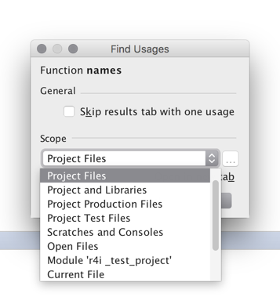

Release Action List
===================

1. Increase version
2. Snapshot on github
3. Run tests
4. Deploy jar and upload to plugin reposiotry


Setup and Build
===============

### Gradle


To get started see http://www.jetbrains.org/intellij/sdk/docs/tutorials/kotlin.html

Design Consideration
====================

What defines variable usage in R?
```r
iris  = mutate(iris)
```
This redefines `iris` so when checking for usage second iris is technically not the same.

What does the user expect when search for usage? 
Should the plugin provide _strict_ or _fuzzy_ usage search? This could be done by providing different modes in `com.r4intellij.psi.references.RFindUsagesProvider` 


API Doc Comments
================
* visitor pattern pretty powerful allows for type specific visiting. see com.r4intellij.psi.api.RVisitor
* necessity of 
```
application.invokeLater(new Runnable() {
    @Override
    public void run() {

        application.runWriteAction(new Runnable() {
        ....
```


* option panels for inspections: com.r4intellij.inspections.MissingPackageInspection.createOptionsPanel

## custom language support


## External jars

https://confluence.jetbrains.com/display/IDEADEV/Getting+Started+with+Plugin+Development

This creates a .jar or .zip archive file to be used to install and publish your plugin. If the plugin module does not depend on libraries, the .jar archive will be created. Otherwise, a .zip archive will be created that will include all the plugin libraries specified in the project settings.


## plugin loading

http://stackoverflow.com/questions/11492301/how-does-intellij-idea-manage-plugin-dependencies

IDEA uses custom classloader, if it doesn't find the required class in the plugin distribution, it's searched in all the jars located in IDEA_HOME/lib directory.

https://intellij-support.jetbrains.com/hc/en-us/community/posts/206104839-Access-Resources-bundled-within-Plugin

The debug environment unpacks the jar while the deployed environment does not. So the resources are not available in deployed version same as in debug. I would prefer that the debug version mimicked the deployed one, otherwise it makes it harder to debug.  --> copy stream to file


Reference Provider
----------


https://confluence.jetbrains.com/display/IDEADEV/Developing+Custom+Language+Plugins+for+IntelliJ+IDEA


http://www.jetbrains.org/intellij/sdk/docs/tutorials/custom_language_support/reference_contributor.html

https://intellij-support.jetbrains.com/hc/en-us/community/posts/207250965-PsiReferenceContributor-Find-Usages-and-Go-to-Declaration

search scope
https://intellij-support.jetbrains.com/hc/en-us/community/posts/206793585-Help-with-different-behavior-between-writable-and-readonly-files

my question: https://intellij-support.jetbrains.com/hc/en-us/community/posts/115000093684-Reference-search-scope-different-between-project-files-and-scratches-



* seems to work within a within project context even across files. 

* **[todo]** redeclaration of function with same name (prefer local over global; same dir over other dir)

### datasets

added to sekelton; accessible via stub-index like functions

stub index content
```text
StubIndex.getInstance().getAllKeys(KEY, project).stream().filter(p->p.trim().contains("nasa")).collect(Collectors.toList())
```


## Unquoted method names

Example
```r
require(tidyverse)

count(iris, Species) ## species
mutate(iris, Species) ## species
```

* also certain infix operators like `%$%` need to be whitelisted

* special treatment for unquoted variable by whitelisting certain methods from strict symbol checking
* [rsudio whitelisting model](https://github.com/rstudio/rstudio/blob/master/src/gwt/acesupport/acemode/r_code_model.js) (laste update 11/2016) 
* **[todo]** allow to add user method to white-listing -> 
    * quickfix1: "flag unquoted argument 'foo' as unquoted variable in R preferences"
    * quickfix2: "flag unquoted argument 'foo' as resolved with annotation"


Note: ignoring tripledot args in resolver is not general enough, see `dplyr::tally`


## Pipe `%>%` support

affects multiple sub-systems
- type-checking, because 1st arg may be missing (or not if dot is used)
- resolver (dot should be resolve to LHS arg in pipe)
- make sure pipe affects usage of variables. Example in `iris %>% mutate()` iris is used, even if the usage is not part of the psi


Misc
- there might be different pipe-operators and not just `%>%`
- what about the popular `%<>%`?

Usecases

* dot in pipes should resolve correctly
```r
"foo" %>% paste0(".", ., ".RData")
```

* argument n is missing with no default in piped expression
`"foo.bar" %>% str_split_fixed("[.]")`

* argument n is missing with no default in piped expression with dot
`"foo.bar" %>% gsub("foo", "is.cool", .)`

* missing arg inspection does not recognize dplyr piping --> Ignore first arg if right-hand-size of pipe 


Documentation Provider
======================


Refactoring API
============

https://intellij-support.jetbrains.com/hc/en-us/community/posts/206783125-Refactoring-Architecture-for-Plugins

In openapi.jar there is a com.intellij.refactoring.util.RefactoringMessageDialog which seems to be extended only by com.intellij.refactoring.inline.InlineParameterDialog in idea.jar, so all the other refactorings are using a different base for their dialogs.


To make sure that renaming does not apply to installed packages/library --> https://intellij-support.jetbrains.com/hc/en-us/community/posts/115000062144-How-to-prevent-renaming-of-library-functions-

* Basic refactorings to match StatET ()


Intentions vs. Inspections
=========================


* consider to use `    <codeInsight.unresolvedReferenceQuickFixProvider
                           implementation="com.intellij.psi.impl.source.resolve.reference.impl.providers.SchemaReferenceQuickFixProvider"/>` for better API design
                           
* conider to use `com.intellij.codeInsight.intention.LowPriorityAction` 


 
good docs http://www.jetbrains.org/intellij/sdk/docs/tutorials/code_intentions.html

interesting base class `com.intellij.codeInspection.LocalQuickFixAsIntentionAdapter`

* Inspections: Error warning + fix
    * Error/warning indicators in code and at the right side
* Local refactorings (like expression conversion)
    * More hidden: just show up when using Alt-Enter


many potentially useful base-classes
`com.intellij.codeInspection.LocalQuickFixAndIntentionActionOnPsiElement`


In openapi.jar there is a com.intellij.refactoring.util.RefactoringMessageDialog which seems to be extended only by com.intellij.refactoring.inline.InlineParameterDialog in idea.jar, so all the other refactorings are using a different base for their dialogs.


Completion Provider
==================

make sure to match https://rawgit.com/kevinushey/2017-rstudio-conf/master/slides.html#9


for path completion see https://www.jetbrains.com/help/idea/2016.3/completing-path.html


http://www.jetbrains.org/intellij/sdk/docs/tutorials/custom_language_support/completion_contributor.html


https://www.jetbrains.com/help/idea/2016.3/auto-completing-code.html

https://dzone.com/articles/top-20-code-completions-in-intellij-idea

https://confluence.jetbrains.com/display/IDEADEV/Completion+features


### Path completion

https://intellij-support.jetbrains.com/hc/en-us/community/posts/206114249-How-to-complete-string-literal-expressions-


Skeletons
===========

skeletons are saved under  (see module deps --> libaries)
`/Users/brandl/Library/Caches/IntelliJIdea2016.1/plugins-sandbox/system/r_skeletons/-1481726564`

Among other used to get paramter list of method see
com.r4intellij.inspections.typing.RTypeChecker.getNamedArguments

Seems built by manual invocation in
`com.r4intellij.actions.RSkeletonsGeneratorAction.generateSkeletonsForPackage` which itself calls
`updateSkeletons`

tricky packages for skeletonizer
* config
* RGtk2

see com.r4intellij.RPsiUtils.findCall

In RS users can jump to library functions but can't go any further (like digging through the R API)

---
https://intellij-support.jetbrains.com/hc/en-us/community/posts/206765345-How-to-trigger-GeneralHighlightingPass-operations-after-file-based-indexing-process-

File based indexes should always be up to date. If your annotating code accesses the index IntelliJ will detect that the index is out of date and re-index the file. 


Formatter
---------

http://www.jetbrains.org/intellij/sdk/docs/reference_guide/custom_language_support/code_formatting.html

formatter modifies only the characters between blocks, and the tree of blocks must be built in such a way that the bottom-level blocks cover all non-whitespace characters in the file

Nice example for code-style settings
/Users/brandl/projects/jb/intellij-community/json/src/com/intellij/json/formatter/JsonCodeStyleSettings.java

Misc
=====

https://intellij-support.jetbrains.com/hc/en-us/community/posts/207567045-How-to-get-the-parent-psi-element-outside-of-a-language-injection

Invoking psi.getContext in a loop (orPsiTreeUtil.getContextOfType) will eventually switch from injected to host PSI.

### Action System

https://intellij-support.jetbrains.com/hc/en-us/community/posts/207173935-How-do-I-invoke-an-action-from-another-


---
https://intellij-support.jetbrains.com/hc/en-us/community/posts/207379815-AnActionEvent-cannot-share-data-context-between-Swing-events-

DataContext is an abstraction of current focus position. You can't use DataContext if focus has changed (say a popup was shown, editor is closed or not focused anymore, etc). We guarantee that focus and components hierarchy won't be changed in actionPerfomed() method until you explicitly request it (by showing modal dialogs, or passing data context into another thread, or passing it into invokeLater(), and so on). 

General approach here is to collect necessary data before you trigger any UI activity.

### Language injection

https://intellij-support.jetbrains.com/hc/en-us/community/posts/206778055-language-injection-into-string-litehttps://www.rstudio.com/rviews/2017/01/27/january-17-tips-and-tricks/rals

### Templates

* /Users/brandl/Library/Preferences/IntelliJIdea2016.3/templates/R.xml
* /Users/brandl/Library/Caches/IntelliJIdea2016.1/plugins-sandbox/config/templates/R.xm
