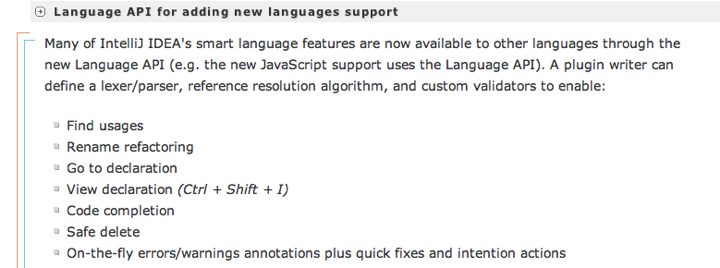

Release Action List
===================

1. Increase version
2. Snapshot on github
3. Run tests
4. Deploy jar and upload to plugin reposiotry

API Doc Comments
================

## custom language support

## Intentions vs. Inspections

* Inspections: Error warning + fix
    * Error/warning indicators in code and at the right side
* Local refactorings (like expression conversion)
    * More hidden: just show up when using Alt-Enter

In openapi.jar there is a com.intellij.refactoring.util.RefactoringMessageDialog which seems to be extended only by com.intellij.refactoring.inline.InlineParameterDialog in idea.jar, so all the other refactorings are using a different base for their dialogs.

## External jars

https://confluence.jetbrains.com/display/IDEADEV/Getting+Started+with+Plugin+Development

This creates a .jar or .zip archive file to be used to install and publish your plugin. If the plugin module does not depend on libraries, the .jar archive will be created. Otherwise, a .zip archive will be created that will include all the plugin libraries specified in the project settings.

## plugin loading

http://stackoverflow.com/questions/11492301/how-does-intellij-idea-manage-plugin-dependencies

IDEA uses custom classloader, if it doesn't find the required class in the plugin distribution, it's searched in all the jars located in IDEA_HOME/lib directory.

Reference Provider
----------

https://confluence.jetbrains.com/display/IDEADEV/Developing+Custom+Language+Plugins+for+IntelliJ+IDEA

http://www.jetbrains.org/intellij/sdk/docs/tutorials/custom_language_support/reference_contributor.html

https://intellij-support.jetbrains.com/hc/en-us/community/posts/207250965-PsiReferenceContributor-Find-Usages-and-Go-to-Declaration

* seems to work within a within project context even across files. 

* **[todo]** redeclaration of function with same name (prefer local over global; same dir over other dir)

Documentation Provider
======================

Refactorings
============

https://intellij-support.jetbrains.com/hc/en-us/community/posts/206783125-Refactoring-Architecture-for-Plugins

In openapi.jar there is a com.intellij.refactoring.util.RefactoringMessageDialog which seems to be extended only by com.intellij.refactoring.inline.InlineParameterDialog in idea.jar, so all the other refactorings are using a different base for their dialogs.

http://www.jetbrains.org/intellij/sdk/docs/tutorials/custom_language_support/completion_contributor.html

Skeletons
===========

skeletons are saved under  (see module deps --> libaries)
`/Users/brandl/Library/Caches/IntelliJIdea2016.1/plugins-sandbox/system/r_skeletons/-1481726564`

Among other used to get paramter list of method see
com.r4intellij.typing.RTypeChecker.getNamedArguments

Seems built by manual invocation in
`com.r4intellij.actions.RSkeletonsGeneratorAction.generateSkeletonsForPackage` which itself calls
`com.r4intellij.interpreter.RSkeletonGenerator.runSkeletonGeneration`

tricky packages for skeletonizer
* config
* RGtk2

see com.r4intellij.RPsiUtils.findCall

In RS users can jump to library functions but can't go any further (like digging through the R API)

## Misc

https://intellij-support.jetbrains.com/hc/en-us/community/posts/207567045-How-to-get-the-parent-psi-element-outside-of-a-language-injection

Invoking psi.getContext in a loop (orPsiTreeUtil.getContextOfType) will eventually switch from injected to host PSI.